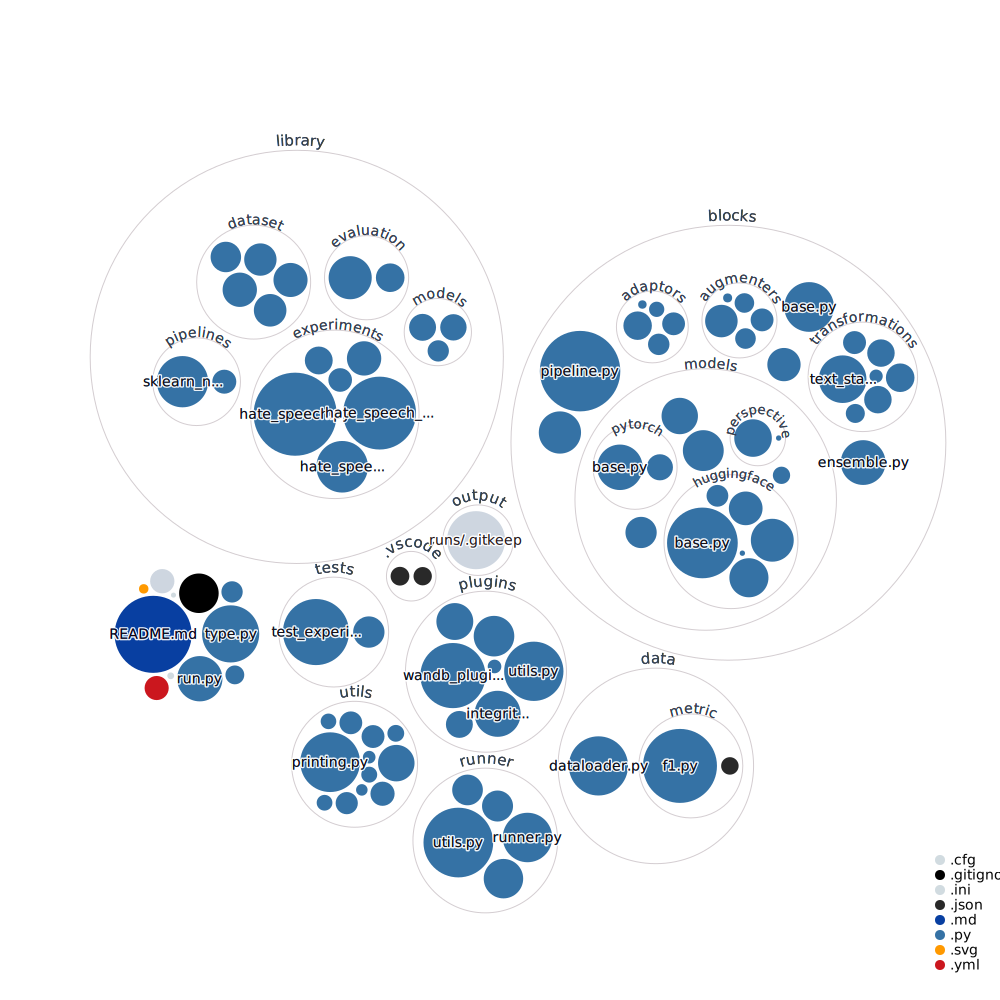

# modular-pipelines


<div id="top"></div>


<!-- PROJECT SHIELDS -->
<!--
*** I'm using markdown "reference style" links for readability.
*** Reference links are enclosed in brackets [ ] instead of parentheses ( ).
*** See the bottom of this document for the declaration of the reference variables
*** for contributors-url, forks-url, etc. This is an optional, concise syntax you may use.
*** https://www.markdownguide.org/basic-syntax/#reference-style-links
-->
[![Contributors][contributors-shield]][contributors-url]
[![Issues][issues-shield]][issues-url]
[![MIT License][license-shield]][license-url]
<!-- [![Stargazers][stars-shield]][stars-url] -->
<!-- [![Forks][forks-shield]][forks-url] -->
<!-- [![LinkedIn][linkedin-shield]][linkedin-url] -->


<!-- PROJECT LOGO -->
<br />
<div align="center">
  <a href="https://github.com/applied-exploration/modular-pipelines">
    <!--  -->
  </a>

<h3 align="center">Modular Pipelines</h3>
  <p align="center">
    Easy composition of ML Pipelines
    <br />
    <a href="https://github.com/applied-exploration/modular-pipelines"><strong>Explore the docs »</strong></a>
    <br />
    <br />
    <a href="https://github.com/applied-exploration/modular-pipelines">View Demo</a>
    ·
    <a href="https://github.com/applied-exploration/modular-pipelines/issues">Report Bug</a>
    ·
    <a href="https://github.com/applied-exploration/modular-pipelines/issues">Request Feature</a>
  </p>
</div>


<!-- TABLE OF CONTENTS -->
<details>
  <summary>Table of Contents</summary>
  <ol>
    <li>
      <a href="#about-the-project">About The Project</a>
      <ul>
        <li><a href="#built-with">Compatible With</a></li>
      </ul>
    </li>
    <li>
      <a href="#getting-started">Getting Started</a>
      <ul>
        <li><a href="#prerequisites">Prerequisites</a></li>
        <li><a href="#installation">Installation</a></li>
      </ul>
    </li>
    <li><a href="#usage">Usage</a></li>
    <li><a href="#roadmap">Roadmap</a></li>
    <li><a href="#contributing">Contributing</a></li>
    <li><a href="#license">License</a></li>
    <li><a href="#contact">Contact</a></li>
    <li><a href="#acknowledgments">Acknowledgments</a></li>
  </ol>
</details>



<!-- ABOUT THE PROJECT -->
## About The Project

<!-- [![Product Name Screen Shot][product-screenshot]](https://example.com) -->

Modular Pipelines is a lightweight and extensible library to create complex multi-model and multi-modal pipelines, including ``Ensembles`` and ``Meta-Models``.

<p align="right">(<a href="#top">back to top</a>)</p>


### Compatible With

* [![Pytorch][Pytorch.js]][Pytorch-url]
* [![Sklearn][Sklearn.js]][Sklearn-url]


<p align="right">(<a href="#top">back to top</a>)</p>


<!-- GETTING STARTED -->
## Getting Started

The project was entire built in ``python``

### Prerequisites

* ``conda`` and ``python >= 3.7``


### Installation

1. The repo comes with a conda env file, enter `mamba env create` to install all dependencies

2. We use isort + black for formatting

To be able to use ``Huggingface`` and ``Wandb``:

3. Enter your ``Wandb`` and ``Huggingface`` API in `.env`
   ```python
    HF_HUB_TOKEN = [ENTER YOUR API]
    WANDB_API_KEY = [ENTER YOUR API]
   ```


<p align="right">(<a href="#top">back to top</a>)</p>


<!-- USAGE EXAMPLES -->
<!-- ## Usage

Use this space to show useful examples of how a project can be used. Additional screenshots, code examples and demos work well in this space. You may also link to more resources.

_For more examples, please refer to the [Documentation](https://example.com)_

<p align="right">(<a href="#top">back to top</a>)</p> -->


<!-- ROADMAP -->
<!-- ## Roadmap

- [ ] Feature 1
- [ ] Feature 2
- [ ] Feature 3
    - [ ] Nested Feature

See the [open issues](https://github.com/applied-exploration/modular-pipelines/issues) for a full list of proposed features (and known issues).

<p align="right">(<a href="#top">back to top</a>)</p> -->


<!-- CONTRIBUTING -->
<!-- ## Contributing

Contributions are what make the open source community such an amazing place to learn, inspire, and create. Any contributions you make are **greatly appreciated**.

If you have a suggestion that would make this better, please fork the repo and create a pull request. You can also simply open an issue with the tag "enhancement".
Don't forget to give the project a star! Thanks again!

1. Fork the Project
2. Create your Feature Branch (`git checkout -b feature/AmazingFeature`)
3. Commit your Changes (`git commit -m 'Add some AmazingFeature'`)
4. Push to the Branch (`git push origin feature/AmazingFeature`)
5. Open a Pull Request

<p align="right">(<a href="#top">back to top</a>)</p> -->


<!-- LICENSE -->
<!-- ## License

Distributed under the MIT License. See `LICENSE.txt` for more information.

<p align="right">(<a href="#top">back to top</a>)</p> -->


<!-- CONTACT -->
## Contact

<!-- Your Name - [@twitter_handle](https://twitter.com/twitter_handle) - email@email_client.com -->

Project Link: [https://github.com/applied-exploration/modular-pipelines](https://github.com/applied-exploration/modular-pipelines)

<p align="right">(<a href="#top">back to top</a>)</p>


<!-- ACKNOWLEDGMENTS -->
<!-- ## Acknowledgments

* []()
* []()
* []()

<p align="right">(<a href="#top">back to top</a>)</p> -->


<!-- MARKDOWN LINKS & IMAGES -->
<!-- https://www.markdownguide.org/basic-syntax/#reference-style-links -->
[contributors-shield]: https://img.shields.io/github/contributors/applied-exploration/modular-pipelines.svg?style=for-the-badge
[contributors-url]: https://github.com/applied-exploration/modular-pipelines/graphs/contributors
[forks-shield]: https://img.shields.io/github/forks/applied-exploration/modular-pipelines.svg?style=for-the-badge
[forks-url]: https://github.com/applied-exploration/modular-pipelines/network/members
[stars-shield]: https://img.shields.io/github/stars/applied-exploration/modular-pipelines.svg?style=for-the-badge
[stars-url]: https://github.com/applied-exploration/modular-pipelines/stargazers

[issues-shield]: https://img.shields.io/github/issues/applied-exploration/modular-pipelines.svg?style=for-the-badge

[issues-url]: https://github.com/applied-exploration/modular-pipelines/issues
[license-shield]: https://img.shields.io/github/license/applied-exploration/modular-pipelines.svg?style=for-the-badge
[license-url]: https://github.com/applied-exploration/modular-pipelines/blob/master/LICENSE.txt
<!-- [linkedin-shield]: https://img.shields.io/badge/-LinkedIn-black.svg?style=for-the-badge&logo=linkedin&colorB=555
[linkedin-url]: https://linkedin.com/in/linkedin_username
[product-screenshot]: images/screenshot.png -->

[Pytorch.js]: https://img.shields.io/badge/pytorch-000000?style=for-the-badge&logo=pytorch&logoColor=4FC08D
[Pytorch-url]: https://pytorch.org/

[Sklearn.js]: https://img.shields.io/badge/sklearn-000000?style=for-the-badge&logo=scikit-learn&logoColor=61DAFB
[Sklearn-url]: https://scikit-learn.org/

